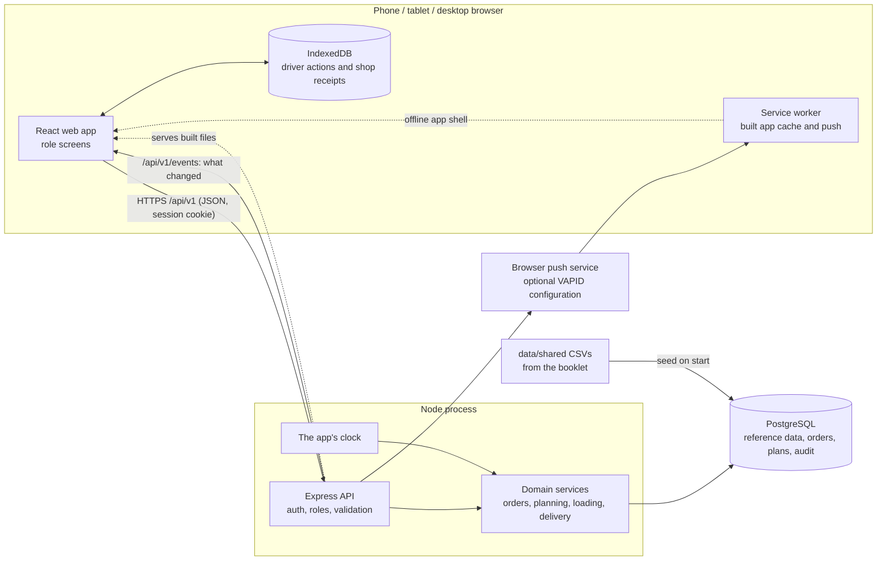

# Architecture

Wayfinder is one Node application and one Postgres database. The same process serves the web app, the API and
live updates, so there is one address, one deploy and nothing to keep in sync between services.

## Parts

| Part | Where | Job |
| --- | --- | --- |
| Web app | `apps/web` | React + Vite, Tailwind with shadcn/ui (Base UI). One app, a route group per role. Phone-first for shop, loader and driver; desktop for dispatcher. |
| API | `apps/api` | Express 5. Protected routes check the session, role and record scope; Zod validates request shapes. Health and sign-in are public. |
| Contracts | `packages/contracts` | Zod schemas both sides import, so the web app and API cannot disagree about a request's shape. |
| Database | `apps/api/src/db` | Drizzle schema, committed SQL migrations in `apps/api/drizzle`, idempotent seed. |

## The clock

Delivery-day times come from one clock in the API (`apps/api/src/lib/clock.ts`), never from a device
(D-18). In demo mode it runs from the seeded day, and the demo control moves it forward a part of the day at a
time. It is kept in the `demo_day` row, so a restart or a second browser sees the same time. Screens ask for it
and advance the displayed time locally between reads. Session expiry, PIN lockouts and retry timing use real
time, so moving the demo clock does not change security limits. The clock tests enforce the allowed boundaries.

## Live updates

After a change is committed, the API announces what changed (`orders`, `plans`, `clock` and so on) on a
server-sent event stream, `GET /api/v1/events` (D-21). Each open screen hears only what is its business, by
role, depot or outlet, and fetches the data again itself. The stream carries no data, so a screen that missed
an announcement recovers through refetching. Reconnecting invalidates cached queries, and regular refetches
provide a fallback. This event bus lives in the Node process; it is not a multi-instance message broker.

## Offline work and photos

The built web app has a service worker that caches the app files, not API responses. Driver work and shop
receipts keep their own account-bound data and queued writes in IndexedDB. On reconnect, the queue retries
writes with stable IDs; the server records applied writes in `driver_writes` so a retry cannot count twice.
The server still checks identity, revision and trip state before accepting an action. Loading, planning and
receiving-readiness edits require a connection.

Driver proof photos and shop report photos are stored as JPEG bytes in PostgreSQL. The photo and its delivery
or issue commit together. Authorized viewers fetch the bytes through the API and display temporary object URLs.

## Notifications

Bell updates are derived from recorded orders, trips and issues. Read state is kept in the browser per account
and demo day. Optional web push stores each browser subscription in `push_subscriptions` and sends through
the browser's push service. It needs configured VAPID keys, permission and a successful subscription; permission
alone does not establish delivery to a suspended page.
Dispatcher push reads the depot that changed and includes its name and a scoped link. Subscribing marks
existing updates from both depots as seen, and opening a push uses the normal guarded depot switch.

## Security basics

- Staff IDs and four-digit PINs are used for sign-in; PINs are hashed with Argon2. Sessions use random tokens
  in an httpOnly, SameSite cookie, marked Secure over HTTPS; only a hash of the
  token is stored.
- Protected routes use `requireRole` plus outlet/depot checks. Admin passes the role guard, but still needs
  the scope required by a depot or outlet route.
- Rate limits: 300 requests a minute per address on the API, excluding the live stream; 10 failed sign-ins
  per 15 minutes per address. Five consecutive wrong PINs lock a staff ID for 15 minutes.
- Writes must be JSON, which blocks cross-site form posts. Helmet sets the usual security headers.
- Logs record method, path and status only, never cookies or bodies.

## How a change gets in

The process is spec, branch, pull request, independent review, passing CI, then merge. CI checks types, a fresh
migration and seed, schema/migration agreement, tests and build. The full loop is in
[the spec guide](specs/README.md).

## Read-only planning comparisons

The vehicle-unavailable preview reuses the same planner and checker for two copies of one authorized snapshot.
Only one vehicle's availability changes. It does not open or save a plan, persist generated split orders or write
fuel usage. The response identifies the input snapshot, reconciles split parts into original outstanding orders,
and keeps generated-plan results distinct from the saved draft. The web app discards results when their board,
account, depot, day or selection changes.

## Receiving declarations

A store manager's direct, account-bound readiness write checks the application-calendar date, demo generation and
revision under the outlet lock. It never joins the offline outbox. The declaration and its audit record commit
together; later live invalidation targets the relevant recipients. Notifications filter the audit's demo generation
so a reset cannot revive an old declaration. Driver reads attach the declaration for the actual trip's plan date,
while shop and dispatcher cards read the current calendar day independently of the ordering cutoff.
