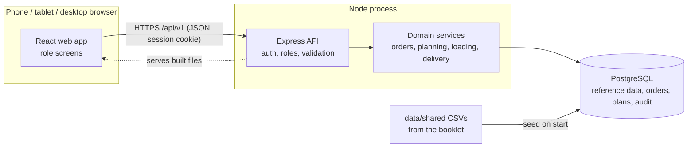

# Architecture

Wayfinder is one Node application and one Postgres database. The same process serves the web app, the API and
(later) live updates, so there is one address, one deploy and nothing to keep in sync between services.

## Parts

| Part | Where | Job |
| --- | --- | --- |
| Web app | `apps/web` | React + Vite, Tailwind with shadcn/ui (Base UI). One app, a route group per role. Phone-first for shop, loader and driver; desktop for dispatcher. |
| API | `apps/api` | Express 5. Checks the session and role on every request and validates every input with Zod. |
| Contracts | `packages/contracts` | Zod schemas both sides import, so the web app and API cannot disagree about a request's shape. |
| Database | `apps/api/src/db` | Drizzle schema, committed SQL migrations in `apps/api/drizzle`, idempotent seed. |

## Security basics

- Passwords hashed with Argon2. Sessions are random tokens in an httpOnly, SameSite cookie; only a hash of the
  token is stored.
- Role check on every route (`requireRole`); admin can open everything.
- Rate limits: 300 requests a minute per address on the API, 10 sign-in attempts per 15 minutes.
- Writes must be JSON, which blocks cross-site form posts. Helmet sets the usual security headers.
- Logs record method, path and status only, never cookies or bodies.

## How a change gets in

Spec, branch, pull request, a review by someone who did not write it, CI passes (typecheck, fresh migrate and
seed, schema matches migrations, tests, build), merge. `main` is always deployable. The full loop is in
`docs/specs/README.md`.
