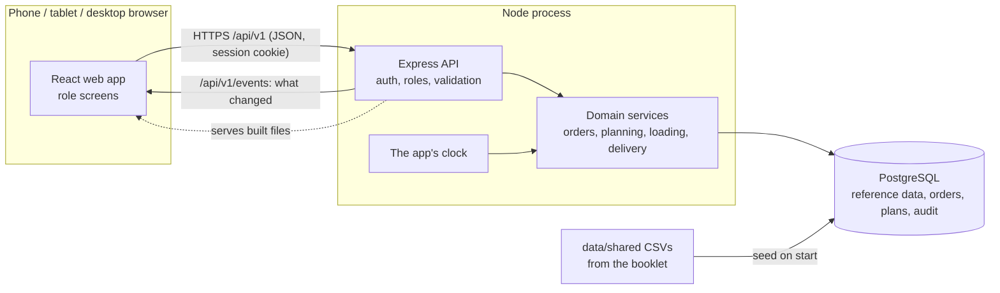

# Architecture

Wayfinder is one Node application and one Postgres database. The same process serves the web app, the API and
live updates, so there is one address, one deploy and nothing to keep in sync between services.

## Parts

| Part | Where | Job |
| --- | --- | --- |
| Web app | `apps/web` | React + Vite, Tailwind with shadcn/ui (Base UI). One app, a route group per role. Phone-first for shop, loader and driver; desktop for dispatcher. |
| API | `apps/api` | Express 5. Checks the session and role on every request and validates every input with Zod. |
| Contracts | `packages/contracts` | Zod schemas both sides import, so the web app and API cannot disagree about a request's shape. |
| Database | `apps/api/src/db` | Drizzle schema, committed SQL migrations in `apps/api/drizzle`, idempotent seed. |

## The clock

Every time a person sees comes from one clock in the API (`apps/api/src/lib/clock.ts`), never from a device
(D-18). In demo mode it runs from the seeded day, and the demo control moves it forward a part of the day at a
time. It is kept in the `demo_day` row, so a restart or a second browser sees the same time. Screens ask for it
once and count the seconds themselves. A test fails if any other file reads the system time.

## Live updates

After a change is committed, the API announces what changed (`orders`, `plans`, `clock` and so on) on a
server-sent event stream, `GET /api/v1/events` (D-21). Each open screen hears only what is its business, by
role, depot or outlet, and fetches the data again itself. The stream carries no data, so a screen that missed
an announcement is only as stale as its next fetch, and each screen also refetches every minute.

## Security basics

- Passwords hashed with Argon2. Sessions are random tokens in an httpOnly, SameSite cookie; only a hash of the
  token is stored.
- Role check on every route (`requireRole`); admin can open everything.
- Rate limits: 300 requests a minute per address on the API, 10 sign-in attempts per 15 minutes.
- Writes must be JSON, which blocks cross-site form posts. Helmet sets the usual security headers.
- Logs record method, path and status only, never cookies or bodies.

## How a change gets in

Spec, branch, pull request, a review by someone who did not write it, CI passes (typecheck, fresh migrate and
seed, schema matches migrations, tests, build), merge. `main` is always deployable. The full loop is in
`docs/specs/README.md`.

## Read-only planning comparisons

The vehicle-unavailable preview reuses the same planner and checker for two copies of one authorized snapshot.
Only one vehicle's availability changes. It does not open or save a plan, persist generated split orders or write
fuel usage. The response identifies the input snapshot, reconciles split parts into original outstanding orders,
and keeps generated-plan results distinct from the saved draft. The web app discards results when their board,
account, depot, day or selection changes.

## Receiving declarations

A store manager's direct, account-bound readiness write checks the application-calendar date, demo generation and
revision under the outlet lock. It never joins the offline outbox. The declaration and its audit record commit
together; later live invalidation targets the relevant recipients. Notifications filter the audit's demo generation
so a reset cannot revive an old declaration. Driver reads attach the declaration for the actual trip's plan date,
while shop and dispatcher cards read the current calendar day independently of the ordering cutoff.
