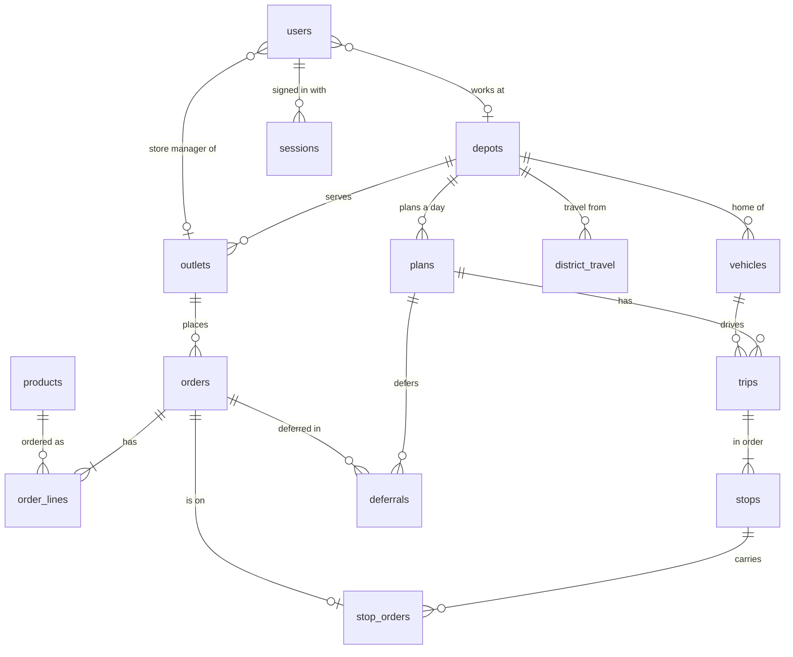

# Data model

Supplied ids (OUT001, VEH001) stay as primary keys, so the Designathon screens, this app and the Datathon all
talk about the same records. New records get UUIDs.

## Groups

| Group | Tables | Notes |
| --- | --- | --- |
| Reference (from the booklet CSVs) | `depots`, `outlets`, `vehicles`, `calendar_days`, `district_travel`, `service_allowance` | Loaded by the seed. Outlets keep dock type, parking rule (normal, van only, mall dock), mall window and delivery window. |
| Products (ours) | `products` | The fixed list in `product-list.md`. Weight and volume are per unit, so a load is always quantity times these. |
| People | `users`, `sessions` | One role per user. A store manager belongs to an outlet, the others to a depot. |
| Demand | `orders`, `order_lines` | One order per temperature, because chilled and dry go on different trucks. Lines store only a quantity. |
| Planning | `plans`, `trips`, `stops`, `stop_orders`, `deferrals` | One plan per depot per day. At most two trips per vehicle. Every order is on a stop or deferred with a reason. |
| History | `audit_log` | Who changed what and when, with before and after. |

Execution (deliveries, proof, receipts, loading checks) and notifications are added with the features that
need them.
