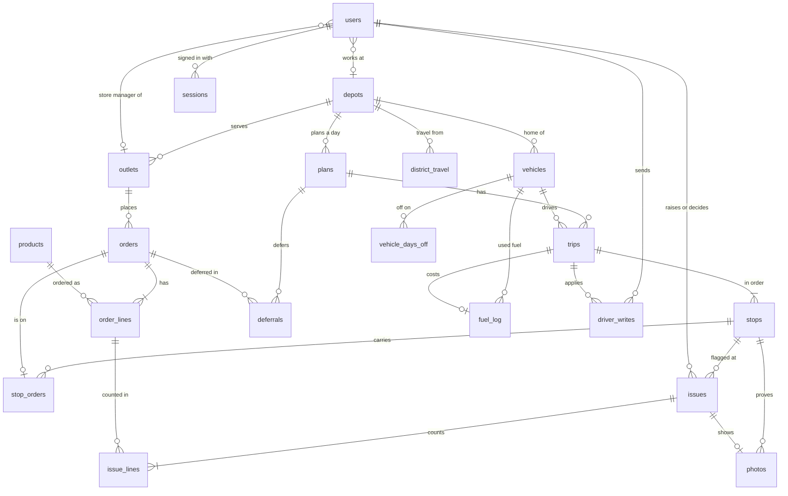

# Data model

Supplied ids (OUT001, VEH001) stay as primary keys, so the Designathon screens, this app and the Datathon all
talk about the same records. New records get UUIDs.

## Groups

| Group | Tables | Notes |
| --- | --- | --- |
| Reference (from the booklet CSVs) | `depots`, `outlets`, `vehicles`, `calendar_days`, `district_travel`, `service_allowance` | Loaded by the seed. Outlets keep dock type, parking rule (normal, van only, mall dock), mall window and delivery window. |
| Products (ours) | `products` | The fixed list in `product-list.md`. Weight and volume are per unit, so a load is always quantity times these. |
| People | `users`, `sessions` | One role per user. A store manager belongs to an outlet, the others to a depot. |
| Demand | `orders`, `order_lines` | One order per temperature, because chilled and dry go on different trucks. An order starts as a draft, and a shop has one draft per temperature at most. Lines store only a quantity, one line per item. |
| Planning | `plans`, `trips`, `stops`, `stop_orders`, `deferrals` | One plan per depot per day. At most two trips per vehicle. Every order is on a stop or deferred with a reason. A sent plan keeps the checker's result it was sent with (`sent_check`). Once the planner has built it, a plan keeps its suggestion (`suggestion`): when it was built, the draft the build saved, the planner's reason for every order and the decisions the dispatcher accepts before sending. Hand edits leave it as built, and the next build replaces it (spec 014). |
| Loading and problems | `issues`, `issue_lines`, and on `trips`, `stops` and `order_lines` | A problem is one record whoever raises it: a loader's flag now, a driver's and a shop's later. Its lines hold the counts it found, and the dispatcher decides it once. A trip carries a revision, its ready time and the id of its last loader write; a stop its loaded time; an order line its loaded count (spec 012). |
| Driver | `driver_writes`, `photos`, and on `trips`, `stops` and `order_lines` | Applied writes bind their UUID to the driver, trip, kind and body hash. Photos commit with their delivery or problem. Trips keep departure, return and last event times; stops keep revisions, retries, arrival, outcome and completion; lines keep delivered counts (spec 013). |
| Fleet days | `vehicle_days_off`, `fuel_log` | A vehicle that cannot be used on a date, with the reason. Litres a vehicle used on a date: one history row a day, and one row for each sent trip. The plan checker reads both. |
| The demo day | `demo_day` | One row: the app's clock, stored as the app's time and the real time it was set, and whether the seeded day has been written. |
| History | `audit_log` | Who changed what and when, with before and after. |

Shop receipts are added with A5. Driver problems keep each closed attempt’s counts even when its orders go on another trip.
