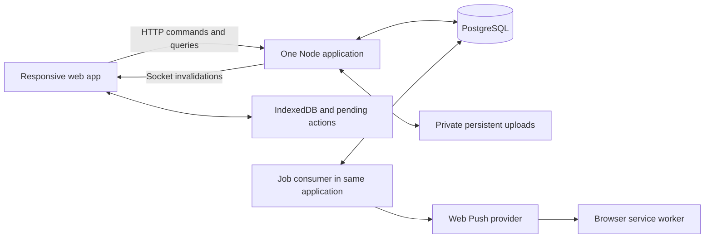

# Wayfinder technical proposal

- **Team:** Vectorious
- **Status:** Draft for Nabil's A–Z review; not an implementation or final stack approval
- **Prepared:** 28 September 2026, Asia/Colombo
- **Application repository:** `Vectorious_Wayfinder`
- **Delivery window used for planning:** 30 September–4 October 2026

## 1. Purpose and decision status

Build the Wayfinder design into a complete, reliable delivery-planning application within five days. Establish a foundation that supports feature iteration without scattering business rules, creating competing sources of truth, or repeatedly changing the stack.

Nabil's experience from the previous competition is the main delivery constraint: overengineering prevented the team from finishing. A strong foundation here means clear ownership, explicit contracts, a consistent structure, reproducible setup, and meaningful tests. It does not mean preparing infrastructure for hypothetical scale.

The target is a working four-role journey by the end of Day 2, the complete required scenario by Day 3, feature freeze and video recording on Day 4, and fixes and submission on Day 5.

| Status | Decision |
| --- | --- |
| Confirmed by Nabil | Use Drizzle instead of Prisma. |
| Confirmed by Nabil | Keep the build achievable within five days while establishing a maintainable foundation. |
| Confirmed by Nabil | Include a super-admin panel for users, staff, vehicles, stores, and essential operational master data. |
| Required by the booklet | Responsive web application across dispatcher, loader, driver, and store manager; planning constraints; seeded data; public deployment; reproducible Compose setup; documentation and video. |
| Proposed in this document | The remaining stack, module boundaries, detailed implementation policies, schedule, and ownership split. |
| Pending first implementation checkpoint | Final submitted-design coverage, team availability, deployment host, and the bounded assumptions in section 21. |

This proposal replaces the earlier Prisma and Redis/BullMQ suggestions. PostgreSQL, Drizzle, one Node backend, and a PostgreSQL-backed job queue form the proposed server foundation. Drizzle is the confirmed ORM choice. Administration is a confirmed product requirement; its detailed design and the remaining stack choices remain reviewable.

### Reading route

1. Scope and evidence: sections 2–3.
2. Stack, boundaries, and file structure: sections 4–6.
3. Data, contracts, and transactions: sections 7–9.
4. Planning, live updates, offline work, and notifications: sections 10–14.
5. Interface, deployment, quality, and growth rules: sections 15–18.
6. Team, five-day execution, decisions, and submission: sections 19–23.

## 2. Evidence and product scope

The booklet is the source for competition requirements. The submitted Designathon file becomes the source for interface and flow fidelity. Local Figma implementation notes describe earlier design changes; they are useful context but do not certify the current live design.

This proposal uses the booklet, supplied CSV inventory, existing design notes, and this planning discussion. It is not a fresh live audit of every Figma screen. Before implementation starts, produce a short screen/action matrix against the final submitted design. Limit that exercise to two hours and update it as features are integrated.

| Area | Working behaviour required |
| --- | --- |
| Store | Create dry/chilled orders as appropriate, receive submission confirmation, inspect order status and deferrals, confirm actual receipt, and report shortages. |
| Dispatcher | Inspect demand, create a draft manually or with assistance, edit allocations and stop order, validate, defer with reasons, publish, monitor execution, resolve issues, and inspect history/fleet information. |
| Loader | See the current published loading list, load in the appropriate reverse stop sequence, record quantities and damage/shortages, see plan changes, and mark readiness. |
| Driver | See the assigned route, record arrival/outcomes/proof, report refusal or inaccessible outlets, retain work offline, synchronize, and finish the trip/return flow. |
| Cross-role | Persisted notifications, live screen updates, relevant push alerts, optional sounds, clear freshness, and acknowledgement of material changes. |
| Recovery | Failed order submission, stale plan, offline delivery/receipt, pending proof upload, conflicting action, and notification failure. |
| Supporting screens | Implement the submitted Orders, History, Fleet, issue-detail, and capacity-related screens using the same records and services as the core journey. |
| Super admin | Manage users and access, staff records and assignments, stores, vehicles, essential master data, and administrative change history. |

Figma success/failure variants become states of shared components. They are not separate applications or independent copies of business logic. A visible action must perform its stated operation, explain why it is unavailable, or be recorded as a deliberate design departure. Fixed prototype navigation is not implementation behaviour.

Future-capacity screens require an explicit source label: supplied scenario, baseline estimate, or an integrated model. A what-if calculation can compare required capacity with available vehicles. A recorded hiring intention must not claim that an external vehicle supplier has confirmed a booking. If the submitted design makes that claim, resolve it during scope review and document any departure.

The judges must be able to enter new valid data, not only click through a hard-coded demo. A repeatable seeded day supports evaluation; it does not replace functional behaviour.

### Administration is part of the working product

The four booklet roles describe the delivery workflow. Super admin is an additional management role explicitly requested by Nabil, with a separate `/admin` route area inside the same application. It uses the same backend, database, validation, and component system. Seed scripts initialize the application; they do not replace administrative screens.

| Screen | Five-day functionality | Important behaviour |
| --- | --- | --- |
| Users and access | Create an account, edit identity, assign a fixed role and permitted depot/store scope, activate/deactivate, and initiate credential reset | Role/scope changes revoke existing sessions and socket access. Never display or recover an existing password. |
| Staff | Create/edit a staff record, staff type, contact details, active status, depot, and links to a login and vehicle assignment where relevant | A staff person and a login account are distinct records; historical work continues to identify the original staff member. |
| Vehicles | Add/edit identifier and descriptive details, type, temperature capability, capacities, fuel profile/quota, depot, driver link, and operational availability | Distinguish temporary unavailability from archival. Capacity, depot, availability, and fuel edits trigger affected-plan checks. |
| Stores/outlets | Add/edit display name, brand, depot, district, contacts, receiving windows, dock/access restrictions, active status, and manager assignment | Changes invalidate affected draft assumptions and create a visible review requirement for affected published work. |
| Operational master data | Maintain the small set of depot/contact settings and demo catalogue attributes needed by implemented features | Expose explicit supported fields. Calendar overrides, if needed, retain source and reason. No generic settings/schema builder. |
| Administrative history | Search/filter who changed a managed record, when, and why; inspect safe before/after values | Passwords, tokens, and other secrets are never recorded in change payloads. |

Start with reusable searchable lists, a create/edit form, active-status controls, and an audit view. Include validation and loading/error/empty states. Reporting dashboards, bulk-edit engines, custom-role builders, impersonation, and a complete HR system are outside this initial admin scope.

Use fixed roles, including `super_admin`, with explicit resource scopes. Administrators manage access and master data; they do not obtain an unrestricted endpoint that can change arbitrary delivery or receipt statuses. Administrative corrections to operational records must use the owning domain's reviewed command and retain history. Guard against disabling or demoting the last active super admin.

Changes to referenced users, staff, vehicles, and outlets use deactivation/archival instead of hard deletion. Existing records remain readable in history; inactive resources are excluded from new assignments. Driver links support coordination and accountability; they do not introduce a separate driver-availability optimization problem beyond the booklet's assumptions.

Imported CSVs remain immutable evidence. Their database records can have audited operational amendments. Mark added demo resources and distinguish the supplied baseline fleet from supplementary resources so new admin entries cannot silently make the competition scenario easier. Seed reruns must not overwrite admin edits.

Published plans retain snapshots or revision references for the vehicle/outlet assumptions they used. A changed capacity, receiving window, depot, or availability cannot silently rewrite a published trip. Record the new master-data revision, invalidate affected drafts, and flag published work for dispatcher review. Block unsafe future publication/departure until the affected plan is revalidated or explicitly amended; completed delivery history remains intact. Show an impact summary before saving a material change and use the same planning validator for the follow-up checks.

Super admin is an online management surface. The public judge walkthrough retains the four operational accounts required by the booklet. Provision a separate operator-controlled admin account: document local setup/reset instructions, keep hosted bootstrap credentials outside the repository, and do not publish powerful admin credentials with the four operational demo logins. Admin changes must still be included in testing and the product's design-coverage/departure record.

## 3. Delivery boundaries

### Included in the five-day baseline

- All four roles and the agreed submitted-design flow.
- The confirmed super-admin surface for accounts, staff, fleet, stores, bounded master-data maintenance, and administrative history.
- Server-enforced planning constraints and explicit deferrals.
- Manual planning plus a bounded deterministic draft generator.
- Live updates and current-state reconciliation after reconnection.
- A persistent notification inbox, Web Push, and opt-in in-app sounds.
- Offline execution records and proof, including restart/retry behaviour.
- Permissions, optimistic concurrency, idempotency, and important change history.
- A deployed HTTPS system, clean Compose installation, fixtures, checks, and submission materials.

### Deferred unless a concrete submitted-design requirement changes the decision

- Microservices, multiple backend replicas, Redis, Kafka, or a general event bus.
- Durable socket-event replay, event sourcing, CRDTs, or collaborative simultaneous plan editing.
- A generic workflow engine, generic repository layer, or plugin system.
- Native mobile apps and a promise of continuous background GPS tracking.
- External webhook management, SMS/email integrations, or supplier integrations without an identified requirement.
- Advanced optimization, traffic-routing infrastructure, a separately deployed ML service, or a mandatory trained model dependency for the hackathon.
- A custom component library package, admin builder, or observability dashboard project.

These boundaries reduce implementation breadth; they do not waive booklet requirements. Cutting a submitted capability is a product decision, recorded with its consequence, rather than something a developer silently does to meet a deadline.

## 4. Proposed stack and deployment shape

| Concern | Choice | Purpose and boundary |
| --- | --- | --- |
| Workspace | npm workspaces, TypeScript | One lockfile and consistent scripts across applications. |
| Web app | React + Vite | One responsive application with role-specific routes. |
| UI | Shared CSS tokens and a small set of reusable controls | Preserve the submitted visual system; use an established accessible primitive where a dialog or menu needs it. |
| Server data | TanStack Query | Query caching, mutation feedback, and targeted invalidation. |
| Contracts | Zod schemas in `packages/contracts` | Runtime validation and inferred transport types; no database dependency. |
| API | Fastify | HTTP routes, sessions, request validation, and domain services. |
| Database | PostgreSQL | Authoritative business records, constraints, notification records, and jobs. |
| ORM | Drizzle ORM + Drizzle Kit | TypeScript schema, explicit queries and transactions, reviewed SQL migrations. |
| PostgreSQL driver | node-postgres (`pg`) | A configured connection pool shared through the database module. |
| Live transport | Socket.IO | Authorized invalidation events; not the only way clients become current. |
| Offline | Dexie / IndexedDB | Working data, durable pending actions, and pending proof blobs. |
| PWA | Service worker with a Vite-compatible Workbox integration | App-shell caching, push handling, and controlled application updates. |
| Jobs | pg-boss | PostgreSQL-backed retryable notification jobs. |
| Files | Private persistent filesystem volume | Sufficient for the initial single-instance deployment; accessed through authorized endpoints. |
| Verification | Vitest, real PostgreSQL integration tests, Playwright | Rules, transactions, multiple-role journeys, and browser recovery. |
| Build/deploy | Multi-stage Dockerfile + Compose | Reproducible local stack and a deployable application image. |

Pin compatible stable versions and the Node runtime during the first setup checkpoint. Commit the lockfile and runtime version file. Use `npm ci` in CI and Docker. Major dependency upgrades are separate reviewed work after the competition baseline is stable.



The production Node process serves the built web app, `/api/v1`, and Socket.IO on one origin. It starts the job consumer after database readiness. Compose has two long-running services: application and database, with persistent database and upload volumes. A managed host may provide PostgreSQL separately, but the public application must have a persistent disk and support long-running socket connections.

CPU-heavy planning must not monopolize this process. The first generator is bounded; measure its runtime on the full supplied fleet. A worker thread or separate job process is a later extraction if measurements justify it, not an initial service split.

## 5. Stable architecture boundaries

Use a modular monolith: one deployment with feature modules that own their data and behaviour.

### Dependency direction

```text
web feature -> shared transport contracts -> HTTP API
web feature -> shared UI / API client / offline infrastructure

API route -> owning module service -> Drizzle / narrow infrastructure
job handler -> owning module service
module service -> another module's explicit public API, when needed

contracts -> validation primitives only
```

The web app must never import server modules, Drizzle tables, environment secrets, or Node-only dependencies. The server must never import web components. Shared contracts contain request/response/event schemas, stable codes, and transport types; they do not contain server-only rules or raw database row types.

### Module responsibilities

| Module | Owns |
| --- | --- |
| `auth` | Users, sessions, fixed roles/resource scopes, account management, credential reset, and current-user identity. |
| `staff` | Staff profiles, active status, and links to accounts, depots, and driver assignments. |
| `reference-data` | Imported outlets/fleet/calendar/travel inputs, audited operational amendments, availability, revisions, and provenance. |
| `orders` | Requests, lines, cutoff eligibility, submission, and order history. |
| `planning` | Drafts, revisions, trips, stops, allocations, deferrals, feasibility checks, and fuel reservations. |
| `loading` | Load checks, shortages, readiness, and plan acknowledgement at the dock. |
| `deliveries` | Driver progress, delivery quantities, proof association, trip completion, and return records. |
| `receipts` | Store acknowledgement of actual goods and receipt discrepancies. |
| `issues` | Operational issue ownership, decisions, reasons, and resolution history. |
| `notifications` | Notification policy, inbox records, subscriptions, delivery jobs, read state, and attention cues. |
| `reporting` | Read-only dashboard, history, fleet, and capacity views over existing records. |

The admin frontend composes these owning modules. `/admin` API routes live in, or delegate immediately to, the relevant module; an admin service must not become a second implementation of account, fleet, or store rules. Reference-data changes coordinate with planning through its public interface to surface affected plans.

Routes translate transport inputs into service calls. Services enforce authorization and business transitions. Pure planning calculations live beside the planning service and receive explicit input snapshots. Domain services do not depend on Fastify request objects or socket instances.

Keep route/service files small enough to understand. Add `queries.ts`, `policy.ts`, or calculation files when responsibilities warrant them. Do not create five architectural layers for a simple operation.

Modules export a narrow `index.ts` public surface. Cross-module writes go through the owning module's service, with a transaction context when the operation must be atomic. Reporting may use deliberate read-only joins across tables. It must not become a back door for writes.

Infrastructure such as files, jobs, and realtime dispatch uses small concrete functions. Introduce an interface only at a real replacement point, such as file storage, rather than abstracting every database call.

### Rules that prevent drift

1. A business rule has one authoritative implementation in its owning server module.
2. Every public request, response, and event has a shared transport contract.
3. Every persisted schema change has a committed migration.
4. Every new state has defined transitions and failure behaviour.
5. Browser server-state, local UI state, and offline pending work have different owners.
6. Additive features follow the existing stack; a new runtime, ORM, state manager, or service needs a short decision record.
7. Import boundaries are checked by ESLint restrictions and CI, not only remembered during reviews.
8. Fix architecture locally when a feature exposes a weakness; do not start a broad rewrite during the five-day build.

## 6. Proposed repository structure

This proposal lives in the current competition project. The structure below describes the application repository to create; it is not a claim these implementation files already exist.

```text
Vectorious_Wayfinder/
├── apps/
│   ├── web/
│   │   ├── src/
│   │   │   ├── app/                 # Router, providers, composition
│   │   │   ├── features/
│   │   │   │   ├── auth/
│   │   │   │   ├── admin/        # Users, staff, vehicles, stores, audit
│   │   │   │   ├── dispatcher/
│   │   │   │   ├── loader/
│   │   │   │   ├── driver/
│   │   │   │   ├── store/
│   │   │   │   └── notifications/
│   │   │   ├── components/
│   │   │   │   ├── ui/             # Buttons, dialogs, badges, fields
│   │   │   │   └── layout/         # Shared shells and navigation
│   │   │   ├── lib/
│   │   │   │   ├── api.ts
│   │   │   │   ├── query-client.ts
│   │   │   │   ├── realtime.ts
│   │   │   │   └── sounds.ts
│   │   │   ├── offline/
│   │   │   │   ├── db.ts
│   │   │   │   ├── outbox.ts
│   │   │   │   └── sync.ts
│   │   │   ├── styles/tokens.css
│   │   │   ├── sw.ts
│   │   │   └── main.tsx
│   │   ├── public/                # Icons and bundled sounds only
│   │   ├── vite.config.ts
│   │   └── package.json
│   └── api/
│       ├── src/
│       │   ├── modules/           # Domain modules from section 5
│       │   ├── db/
│       │   │   ├── client.ts
│       │   │   ├── schema/        # Tables grouped by owning domain
│       │   │   ├── migrate.ts
│       │   │   └── seed.ts
│       │   ├── realtime/socket.ts
│       │   ├── jobs/
│       │   │   ├── queue.ts
│       │   │   └── handlers.ts
│       │   ├── files/storage.ts
│       │   ├── lib/               # Config, logging, small infrastructure
│       │   ├── app.ts             # Application assembly; testable
│       │   └── server.ts          # Listen, start jobs, shutdown
│       ├── drizzle/              # Committed SQL and migration metadata
│       ├── tests/integration/
│       ├── drizzle.config.ts
│       └── package.json
├── packages/
│   └── contracts/
│       ├── src/                   # Schemas by feature, errors, events
│       └── package.json
├── data/
│   ├── shared/                    # Necessary unmodified supplied CSVs
│   └── scenarios/                 # Explicit demo fixtures and provenance
├── tests/e2e/
├── docs/
│   ├── architecture.md
│   ├── data-model.md
│   ├── design-coverage.md
│   ├── assumptions.md
│   ├── ai-disclosure.md
│   └── decisions/                 # Short records for foundational changes
├── scripts/bootstrap.sh
├── .github/workflows/ci.yml
├── .env.example
├── .gitignore
├── .nvmrc
├── eslint.config.js
├── tsconfig.base.json
├── Dockerfile
├── compose.yaml
├── package.json
├── package-lock.json
└── README.md
```

A frontend feature owns its `pages/`, feature-only `components/`, `api.ts`, query keys, and hooks. Share a component when there is a real second consumer. Pure rule tests live beside the rule; database integration tests and browser tests have their own locations.

The database folder replaces the earlier proposed `lib/db.ts` and Prisma directory; there is one connection module. The contract package remains small. Do not create separate UI, utility, domain, database, and configuration packages without a demonstrated need.

Do not populate this entire tree with empty scaffolding. Start with runnable web/API/contracts/database pieces and create feature files as needed. Existing Figma tooling stays in the competition workspace, outside the deployed application.

## 7. Data foundation and provenance

### Verified supplied operational files

The following inventory was read from `data/raw/data/General Data` on 28 September 2026:

| File | Rows | Intended use |
| --- | ---: | --- |
| `outlets.csv` | 120 | Brand, district, depot, dock/access restrictions, and delivery windows. |
| `vehicles.csv` | 60 | Type, temperature capability, weight/volume, efficiency, quota, and depot. |
| `calendar.csv` | 910 | Operating dates and calendar features; covers **2024-01-01 through 2026-06-28**. |
| `district_travel.csv` | 12 | District-level distance and time estimates. |
| `service_allowance.csv` | 9 | Brand/dock handling allowances. |
| `traffic_speed.csv` | 576 | District/hour/monsoon speed factors. |
| `road_conditions.csv` | 10,920 | Dated disruption inputs. |

The outlet CSV has no latitude/longitude or named-store catalogue. General Data does not supply a product catalogue or a new September live-order batch. Do not invent exact coordinates, item weights, carton conversions, dates, or real-time traffic and present them as supplied facts.

Use an operating date within supplied calendar coverage for the default scenario, selected and documented during fixture creation. If matching September prototype dates is important, add a separately labelled synthetic calendar/scenario extension. Never quietly extrapolate the supplied calendar. Keep demo business time visible and separate from real session, job, and audit timestamps.

Use supplied outlet and vehicle identifiers consistently. Display names, demo people, catalogue lines, order quantities, and any supplementary map coordinates must be traceable demo fixtures. Record source filename, import version/checksum, and scenario identifier. Raw supplied files remain unchanged.

Planning needs weight and volume. The initial order form can use a small labelled demo catalogue with explicit per-unit weight/volume, or explicit measured totals through an appropriate workflow. Record which approach is accepted before building order entry. Do not infer capacity from carton count alone. The fixture importer rejects missing, negative, or inconsistent values.

### Logical data model

| Record group | Main records and relationships |
| --- | --- |
| Identity | `users`, `sessions`, fixed roles/scopes, account status, and credential-reset records. |
| Staff | `staff_profiles`, account links, depot/store/vehicle assignments, and active status; staff identity survives login deactivation. |
| Reference data | `depots`, `outlets`, `vehicles`, calendar and travel/allowance tables, operational status, revisions, and import provenance. |
| Demand | `orders` and `order_lines`, with outlet, requested operating date, temperature, quantities, weight, and volume. |
| Planning | `plans`, versioned plan snapshots, `trips`, ordered `stops`, `allocations`, and explicit `deferrals`. |
| Resource accounting | Vehicle/day scheduling and weekly fuel reservations/consumption. |
| Loading | Load checks, actual loaded quantities, discrepancies, readiness, and acknowledged plan revision. |
| Execution | Delivery outcomes per allocation/line, proof references, trip/return events. |
| Receipt | Store-confirmed quantities, discrepancy details, and confirmation time. |
| Issues | Issue type, responsible actor, related records, decision, reason, and resolution. |
| Communication | Notifications, push subscriptions, material-plan acknowledgements, and delivery attempts. |
| Reliability | Processed operation IDs, domain history, seed/import metadata, and pg-boss-owned jobs. |

Orders, allocations, deliveries, and receipts are separate facts. A store can dispute what the driver recorded without either observation being overwritten. Remaining demand after a shortage is linked explicitly to the original order; it is not silently duplicated.

### Conventions and constraints

- Keep supplied business IDs as stable unique references; use UUIDs for new records and client-generated operations.
- Represent actual timestamps with timezone-aware values; store business dates separately. Display times and enforce cutoff policy in Asia/Colombo.
- Use integer units for countable items and exact decimal or scaled-integer values for weights, volumes, and fuel. Define API serialization so decimal values do not silently become imprecise floats.
- Add foreign keys, unique keys, non-negative checks, and indexes used by the actual queries. For example, prevent duplicate operation IDs and duplicate stop sequence positions within a trip.
- Add a numeric revision to editable aggregates. Never resolve conflicts by comparing client clocks.
- Published plans retain their published content/version; subsequent edits produce an explicit revision. Historical deliveries remain associated with the revision used.
- Business history records actor, action, affected entity/version, server time, and reason where required. It is separate from diagnostic logs.
- Derived dashboard totals come from persisted facts. Do not maintain unrelated copies in frontend fixtures.
- Referenced staff/master records are archived rather than deleted. Material admin changes retain safe before/after history and are versioned so published planning assumptions can be checked without rewriting historical facts.

### Drizzle migration workflow

Change the TypeScript schema, generate SQL with Drizzle Kit, review the SQL, commit schema and migration together, and test applying it. Run migrations once during startup/bootstrap before the API becomes ready. Restarting must not recreate or erase the database.

Applied migrations are immutable. Add a new migration for corrections. One person coordinates migration generation/merging so parallel branches do not produce an incoherent migration history. Check both a fresh database and an upgrade from the previous application schema.

Use reviewed migrations in shared/deployed environments. Direct schema push is not the team deployment workflow. Seed logic is deterministic and idempotent; ordinary startup must not reset changed demo orders. A destructive demo reset is an explicit local/maintenance command, never a public judge-facing endpoint.

## 8. API and state contracts

Use HTTP endpoints under `/api/v1`. Shared Zod contracts define inputs, outputs, errors, and socket payloads. Generate API documentation from the registered contract schemas where practical; do not maintain a second hand-written definition that can drift.

Representative operations:

| Domain | Proposed endpoints |
| --- | --- |
| Identity | `POST /auth/login`, `POST /auth/logout`, `GET /auth/me` |
| Administration | Scoped list/create/update/deactivate commands under `/admin/users`, `/admin/staff`, `/admin/vehicles`, and `/admin/outlets`; explicit credential-reset and supported-settings commands; read-only `/admin/audit` |
| Orders | `GET /orders`, `POST /orders`, `GET /orders/:id` |
| Planning | `POST /plans`, `PATCH /plans/:id`, `POST /plans/:id/generate`, `POST /plans/:id/validate`, `POST /plans/:id/publish` |
| Loading | `GET /trips/:id/loading`, `POST /trips/:id/load-checks`, `POST /trips/:id/ready` |
| Driver | `GET /my/trips`, `POST /stops/:id/deliveries`, `POST /trips/:id/complete` |
| Receipts | `POST /deliveries/:id/receipts` |
| Issues | `POST /issues`, `POST /issues/:id/decisions` |
| Files | Authorized upload/finalization and download endpoints for proof |
| Notifications | Inbox, mark-read, push subscription registration/removal, and explicit acknowledgement endpoints |
| Reporting | Dashboard, fleet, history, and capacity scenario queries |

Endpoint names are proposals; keep one naming convention once accepted. A method that publishes a plan or marks a truck ready is an explicit business command, not an unrestricted generic status patch.

Mutating requests carry an operation ID when retries are possible and an expected revision where concurrent edits matter. Error responses use stable codes such as `VALIDATION_FAILED`, `STALE_REVISION`, `FORBIDDEN`, and `OPERATION_CONFLICT`, with readable messages and relevant field/record details. Lists use bounded pagination and explicit filters.

Important state transitions include:

- Local order draft → server-confirmed order → allocation or explicit deferral.
- Plan draft → validated publication → revised publication when materially changed.
- Trip published → loading → ready → departed → finished/returned, with explicit exception handling.
- Delivery recorded → proof pending/complete; store receipt and dispute remain distinct records.
- Issue open → decision recorded → resolved when the required business action is complete.
- Local action pending → submitting → server acknowledged, or conflict/rejection requiring attention.

These are separate state dimensions, not one enormous status enum. For example, a completed delivery can still have a pending proof upload or an unresolved receipt discrepancy.

## 9. Transaction and retry guarantees

For a loading shortage:

1. Authenticate the user and authorize access to the trip.
2. Check the operation ID and expected plan/loading revision.
3. In one transaction, save the loading result, issue/history, notification records, and required notification jobs.
4. Commit before showing server-saved status.
5. Emit a minimal invalidation to relevant connected clients.
6. Let a retryable job deliver Web Push for the persisted notification.

Use the supported pg-boss transaction integration with Drizzle only after proving rollback behaviour in an integration test. Both the business change and its job must commit or roll back together. Enqueueing independently and assuming it is atomic is unacceptable. If the pinned integration cannot satisfy this, record the decision and use one small transactional outbox as the replacement mechanism; do not build two competing pipelines.

Idempotency is scoped by authenticated actor and operation kind/ID. Save a payload fingerprint and result with the business mutation. A retry with the same payload returns the same result; reuse with different content returns a conflict. Concurrent duplicate requests are resolved by a database uniqueness constraint, not an in-memory map.

Delivery jobs and browser requests may execute again. Handlers must tolerate retries. Notification delivery records are keyed to the notification, channel, and subscription. The UI deduplicates by notification ID. Do not claim exactly-once network delivery or human receipt.

After a commit, a socket emission may fail. The business operation remains successful; clients recover through current-state fetching and the persisted notification inbox. This intentionally avoids durable socket replay.

## 10. Planning and allocation

### One authoritative validator

Manual edits, generated drafts, and final publication all call the same planning validator. It receives explicit reference data, demand, existing commitments, and a candidate plan, and returns structured violations and calculated metrics. It must not read browser state or invoke UI components.

Validate:

- Both weight and volume for every trip.
- Temperature compatibility, including refrigerated vans.
- Van-only access and assigned depot.
- Operating date, order eligibility, and delivery windows.
- Estimated arrival, waiting, handling, and return/reload assumptions.
- Vehicle schedule overlap and maximum two routes per day.
- Weekly fuel allowance across already committed work and the candidate plan.
- Duplicate allocations, order coverage, and explicit deferral reasons.

The publication transaction locks the relevant plan and resource-accounting rows in a stable order, rereads committed demand/availability, and reruns authoritative checks. A second dispatcher receives a stale/conflict response rather than silently overwriting or overbooking. There is no attempt at collaborative realtime editing.

Reserve estimated fuel when work is published. Revising/cancelling a trip adjusts its reservation transactionally. Consuming a reservation on completion must not count the same fuel twice. When only an estimate exists, label it as estimated rather than measured actual fuel.

### Draft generator

Use a deterministic heuristic with a runtime bound. Prioritize constrained demand and previously deferred outlets according to a visible documented policy; consider compatible vehicles and feasible stop insertions; run the common validator; leave infeasible demand unallocated with reasons for review. Never claim optimality or silently defer to a date with no feasible commitment.

The initial baseline may group by depot, district, and brand to fit available district-level travel estimates. Brand-mixing behaviour and cross-district planning must be reconciled with the submitted design. Treat unsupported combinations as explicit planning limitations, not invented routes.

Published Task 2B uses its own specific same-brand/district constraints and trip-time budgets, including a stated return-journey convention. That datathon evaluator is not automatically the full hackathon planner. Document the hackathon estimator separately: outbound leg, between-stop estimates, waiting, handling, return/reload allowance, and fuel distance. Do not accidentally combine two different timing conventions or advertise district-level estimates as turn-by-turn navigation.

### Future estimates

Keep a narrow estimator function boundary inside planning. The first implementation uses documented allowances and scenario inputs. Later service-time or demand models can supply estimates with a version/source through that boundary. The validator remains authoritative even when model estimates are introduced. No placeholder ML service is deployed now.

## 11. Live updates and freshness

Authenticate Socket.IO connections using the same session identity as HTTP. The server assigns allowed user/depot/outlet/trip subscriptions. Clients cannot join arbitrary rooms by supplying an ID. Recheck authorization after reconnect and remove subscriptions when access or session validity changes.

Emit small invalidation messages after commit, for example:

```json
{
  "type": "trip.updated",
  "entityId": "trip-uuid",
  "revision": 4,
  "occurredAt": "2026-09-30T02:10:00Z"
}
```

Clients invalidate the corresponding query keys and fetch authorized current data. They do not construct the permanent business record from a sequence of socket patches. Refresh on reconnect and when returning to the app. Poll at a modest interval, such as 15–30 seconds, while an active screen cannot use sockets but HTTP remains available. Bound/debounce repeated invalidations.

Show last successful data refresh, and distinguish current, reconnecting, and stale states. A socket disconnect only proves an unavailable connection. It does not prove the driver lost mobile coverage or that a vehicle is in danger.

## 12. Notifications, push, sound, and webhooks

One notification policy maps business events to recipients, urgency, and channels. It belongs in the notifications module, not in individual UI pages or ad hoc route handlers.

| Event | UI update | Inbox | Push/sound policy |
| --- | --- | --- | --- |
| Routine loading progress | Relevant screens | Usually no | Silent |
| Loading shortage/damage | Dispatcher and affected workflow | Yes | Dispatcher push and optional sound |
| Material published-plan change | Affected loader/driver | Yes | Push; explicit plan acknowledgement where required |
| Order deferral | Affected store and dispatcher | Yes | Store push; reason and next-date status |
| Delivery awaiting receipt | Store and dispatcher | Yes | Store push when action is needed |
| Operational issue decision | Relevant participants | Yes | Channel policy according to urgency |
| Successful sync | Local status | Usually no | Silent |
| Rejected/conflicting sync | Local attention state | Only if server recorded an issue | Persistent actionable feedback |

Persist notifications independently of the socket and push channels. Store read state separately from business acknowledgement. Opening a notification does not resolve an issue. Provider acceptance of a push is not confirmation that the device displayed it or the person read it.

Push subscriptions belong to an authenticated user and device/browser installation. Handle denied permission, expired subscriptions, sign-out/account switching, and revoked access. Notification links navigate to an authorized current view; old payloads cannot mutate newer state. Keep lock-screen content minimal.

Request notification permission through a clear user action. For supported iPhone/iPad usage, document the Home Screen web-app installation requirement. Ask users to enable in-app sounds through a click/tap, handle playback rejection, and always retain visual feedback. Provide mute controls. Suppress repeated sounds for the same notification, including across tabs where practical. Avoid replaying a burst of sounds for old inbox items after reconnection.

The app does not promise arbitrary custom sounds while closed, delivery at an exact second, or notification bypass of device settings. Test push on the actual demo phones on Day 1 so device behaviour cannot become a Day 4 surprise.

No external webhook endpoint or delivery manager is included initially. When an actual integration is added, place its adapter in a dedicated integration module, verify incoming signatures, deduplicate messages, validate schemas, and call existing services. It must not write around domain rules.

## 13. Offline execution and reconciliation

### What remains usable

Cache the application shell and download the current user's assigned route/loading/receipt working set before connectivity disappears. Keep an explicit download/readiness state. A first-ever visit without connectivity cannot fetch data it has never received.

Support offline loading observations, delivery outcomes, proof capture, and store receipt/shortage records where required by the submitted flow. Store order drafts locally, but submission is confirmed by the server. An offline draft does not establish that an order beat the 4 PM cutoff. Dispatcher allocation and publication remain online operations.

### One persistent outbox

IndexedDB stores account-partitioned working data, pending commands, associated blobs, and local statuses. In one local transaction, save the user's action and its pending command before displaying local-save success. If the transaction fails or quota is exhausted, display a save failure and preserve the input where possible; never claim durability.

Each command has an operation ID, account, command type/schema version, target record, expected revision, payload, creation time, attempt metadata, and status. Device time is useful context but never overrides server authorization or cutoff rules.

Sync in a bounded queue using the normal command APIs. Respect dependencies: establish the delivery/proof association before finalizing its attachment; preserve the intended sequence of dependent actions. Retry transient failures with backoff. Pause on authentication expiry without discarding work. Keep validation conflicts for review rather than retrying forever.

Retry on launch, foregrounding, successful connectivity checks, and manual retry. Browser Background Sync is an enhancement. Do not depend on the OS allowing background execution after the app closes. Prevent concurrent tab drains using a small local lease/lock, with server idempotency as the final protection.

### Conflict policy

| Situation | Behaviour |
| --- | --- |
| Same operation delivered twice | Return the existing result; do not duplicate records. |
| Plan changed before an offline loading action arrives | Preserve the observation and surface the conflict; do not mark the current plan ready automatically. |
| Driver already physically delivered against an older plan | Retain the original outcome locally; server reconciliation records the historical observation with its referenced revision or routes it for review. Never silently remap quantities to new stops. |
| Receipt differs from driver quantities | Store both observations and open/link an issue. |
| Session expired | Require authentication, then resume the same account's queue. |
| Different user signs into a shared device | Never submit the previous account's queue as the new user; pending work remains isolated and visibly managed. |

The minimal conflict experience is a clear pending/conflict list with the relevant record and a deliberate retry/review action. It is not a generic merge editor. The submitted recovery screens should express these actual states.

Browser storage can be cleared or evicted. Request persistent storage where supported, show readiness, and test failure paths. Describe offline durability as successful local persistence under browser storage constraints, not an unconditional guarantee of permanent storage.

## 14. Proof files, maps, and location

Photos are captured or selected, resized/compressed within a defined limit, and saved locally before acknowledging offline capture. Keep the blob until server upload/finalization is acknowledged. Track record sync and attachment sync separately.

The server validates type and size, assigns safe storage keys, and writes files outside the public web directory. Downloads require authorization through the related delivery. Use an upload/proof ID for retry deduplication, atomic file finalization, and a database attachment state so partial uploads are not shown as complete. A small cleanup job can remove abandoned temporary files after an appropriate retention period.

Filesystem and database commits are not one atomic transaction. Finalization must verify the file exists before marking proof available, and tolerate retry if the process stopped between those steps. If required proof is pending, the UI must say so.

A persistent volume is adequate for one backend instance. File access goes through `files/storage.ts`, making a later object-store replacement local to that boundary. Do not build multiple storage implementations in the five-day baseline.

Map views can show district-level planning and reported progress with their source labels. Supplied outlets have no exact coordinates. Use clearly identified supplementary fixtures or a schematic district map; do not imply routing accuracy from decorative markers. A road-routing provider, coordinate source, license, and credentials would be a separate decision.

Display planned ETA separately from last reported position and last data refresh. Optional foreground location reports can be added only after the source and target-device behaviour are verified. No signal alert should be inferred solely from socket absence. Replay data stays labelled as replay. Driver interaction is designed for use while safely stopped.

## 15. Frontend structure and interface consistency

Use the submitted design's colour, typography, spacing, and component choices as tokens. Existing local notes identify orange `#EF6C00` with slate `#1F2933` for primary controls; verify against the final submitted file before freezing tokens. Reuse accessible dialogs, keyboard focus behaviour, field errors, loading states, and touch targets across roles.

State ownership is explicit:

| State | Owner |
| --- | --- |
| Confirmed server records | TanStack Query and the API |
| Form input, selection, open dialog | Feature/component state |
| Offline working set and unsent actions | IndexedDB/offline module |
| Shareable filters and selected record | URL/search parameters where appropriate |
| Current identity | Session/current-user query |

Do not copy all server data into a second global store. Add shared client state only for a demonstrated need. Each feature owns its query keys and API functions; components use those functions instead of scattered `fetch` calls.

Use a shared pending-action overlay/query composition for offline edits so a background refetch cannot erase unsent input. Show loading, empty, error, stale, local-only, conflict, and success states based on actual operations. Successful plan publication, truck readiness, and receipt submission are not optimistic UI guesses.

Driver and loader layouts are tested at phone sizes. Dispatcher screens adapt deliberately; dense planning controls need an explicit small-screen arrangement rather than simply shrinking a desktop canvas. Include safe page navigation, unsaved-work feedback, readable focus states, and visual equivalents for sounds.

Service-worker updates must not force-reload users with unsynced work. Version the local database and command format, retain queued records during local schema upgrades, and provide an update prompt that waits for safe reload. Maintain compatibility with at least the previous deployed command schema during ordinary rolling client updates, or surface a clear upgrade/review state without dropping commands.

## 16. Security, configuration, and operations

Use a maintained session mechanism with HttpOnly cookies, Secure cookies under HTTPS, and appropriate SameSite settings. Protect state-changing requests against CSRF, including login/logout policy; validate allowed origins for sockets. Hash seeded passwords appropriately, rate-limit login attempts, and avoid placing session credentials in browser local storage.

Every write and sensitive read checks resource ownership, not just the role name. Enforce outlet/depot/trip restrictions in queries and services. Role navigation is presentation only. Private proof files, notification links, and socket subscriptions receive the same authorization treatment.

Admin endpoints require the explicit super-admin permission on the server. Account deactivation, credential reset, and role/scope changes invalidate affected sessions and socket subscriptions. Prevent removal of the last active super admin in a transaction. Administrative audit payloads omit secrets. A role change must never allow another account to drain the former user's offline queue.

Validate environment configuration at startup. Keep `.env.example` complete and secret-free. Distinguish synthetic public demo accounts from infrastructure credentials. Store actual deployment secrets outside source control. Redact passwords, session tokens, push endpoints/keys, and proof contents from logs.

Minimum operational support:

- Request IDs and structured logs with safe operation/entity references.
- A liveness endpoint and readiness checks for database, migrations, and upload storage.
- Job failure visibility through logs and a restricted inspection command; no custom dashboard required.
- Graceful shutdown that stops accepting work and allows in-flight transactions/jobs to finish within a bound.
- Database and upload backup together before risky migrations, with a documented restore procedure.
- Counts or diagnostic queries for pending/failed jobs and sync conflicts.

## 17. Reproducible setup and deployment

`docker compose up` must build/start the complete local application, initialize PostgreSQL, apply migrations, import reference data, seed four accounts and a realistic day, and expose the web app without requiring external cloud credentials.

Also provision a separate local development super-admin account and document how the operator creates or resets the hosted admin account. Local demo credentials are not hosted bootstrap secrets. Seeding and restart preserve administrative edits, account deactivations, and master-data revisions.

Provide safe local demo defaults or checked-in development-only configuration so Compose is genuinely runnable. Explain optional push configuration separately: local notifications and the main workflow work without a remote push service configuration; the public demo deployment includes the tested Web Push setup. HTTPS is required for the hosted PWA/push experience.

Bootstrap waits for database readiness, performs migrations with an appropriate single-run lock, applies non-destructive seed steps, and then starts serving. Failure must exit visibly instead of leaving a superficially healthy app with missing tables. Volumes preserve database and uploads across container replacement.

Deploy on Day 1. Choose a host supporting a persistent disk, HTTPS, long-running HTTP/socket connections, and PostgreSQL connectivity. Avoid an ephemeral filesystem or a serverless-only process model for this initial design. Build once from the lockfile, expose the commit identifier in a safe version endpoint, and smoke-test the served application after deployment.

Check both fresh installation and restart with existing data on another machine. Do not use the developer's already-initialized database as proof that Compose works. A rollback plan must account for schema compatibility, not only an older container image.

## 18. Quality gates and controlled growth

### Automated checks

Root scripts provide consistent `dev`, `build`, `typecheck`, `lint`, `test`, `test:integration`, and `test:e2e` entry points. CI installs with the lockfile, checks import restrictions and types, runs relevant rule/integration tests against PostgreSQL, and builds the deployable image.

Focus tests on failure-prone behaviour:

| Test | Evidence required |
| --- | --- |
| Planning constraints | Each hard rule rejects a violating plan; a valid plan succeeds. |
| Concurrent publication | Competing actions cannot double-allocate demand, trip capacity, or fuel. |
| Idempotency | Repeated and concurrent retries produce one business effect; mismatched payload reuse is rejected. |
| Transactional jobs | Rollback leaves neither business result nor notification job; committed jobs survive process restart. |
| Permissions | A user cannot access another outlet's records, unrelated trips, or private proof. |
| Administration | Operational roles cannot call admin endpoints; the last admin is protected; deactivation revokes sessions/socket access; a referenced archived resource remains in history. |
| Master-data changes | Editing capacity/windows/availability invalidates affected plans; published snapshots remain intact; seed reruns do not overwrite admin edits. |
| Offline recovery | Record an action and photo, reload offline, reconnect, and observe one correct server outcome. |
| Stale plan | Conflict is visible and local observations survive. |
| Socket recovery | Disconnect, change data elsewhere, reconnect, and converge to current state. |
| Notification behaviour | Inbox survives missed push; read and business acknowledgement remain distinct. |
| Files | Restart preserves proof; interrupted upload does not appear complete. |
| Compose | Fresh setup yields the seeded walkthrough; restart does not reset it. |

Use at least one multi-browser-context test for all four roles. Verify phone layouts and actual push/audio separately on target devices; a desktop browser emulation alone is not evidence for mobile push behaviour.

### Definition of done for a feature

The feature follows module boundaries, validates real input, enforces permissions, persists its result, updates the next role, handles the relevant failure state, and passes targeted checks. The owner can explain it. Its design-coverage row and material assumptions are updated. It is integrated into the shared working application.

### How the foundation may evolve

| Future need | Intended extension point | Evidence needed before adding infrastructure |
| --- | --- | --- |
| Better allocation | Replace/extend generator beside the same validator | Runtime/quality comparison and unchanged validity tests. |
| Trained estimates | Planning estimator function | Model version, valid inputs, fallback, and prediction quality. |
| Object storage | File storage module | Deployment/storage requirement and upload/download compatibility. |
| Separate worker | Existing job consumer entry point | Measured blocking or operational isolation need. |
| Multiple API instances | Session, socket, file, and job boundaries | Load evidence and a reviewed shared-adapter/storage plan. |
| External integration | Dedicated adapter calling domain services | Identified consumer, contract, authentication, and retry semantics. |
| New screen/feature | Existing role feature and owning backend module | Coverage, permissions, contract, and behaviour tests. |

Foundational changes need a short decision record stating the problem, choice, tradeoff, migration effect, and owner. This applies to new packages/services, database or transport changes, authentication changes, and crossing established module boundaries. Ordinary feature additions follow the existing pattern without an architecture meeting.

Name one architecture/contract owner and one schema coordinator. They can be the same person. Keep reviews quick and concrete; these roles prevent drift, not create a permission bottleneck.

## 19. Team ownership and integration

The recorded team size is seven; actual availability and skill distribution still need confirmation. Proposed responsibilities:

| Owner slot | Primary responsibility |
| --- | --- |
| 1 | Backend foundation, authentication/account-admin services, contracts, and schema coordination. |
| 2 | Planning validation, allocation, and associated data assumptions. |
| 3 | Dispatcher screens and the shared admin list/form layout; delegate individual admin screens once this pattern exists. |
| 4 | Loader and driver interfaces. |
| 5 | Store interface/receipts and store/staff administration using the shared pattern. |
| 6 | Offline queue, synchronization, sockets, and notifications with the feature owners. |
| 7 | Deployment, integration checks including admin access/history, documentation, and demo coordination. |

This is an ownership proposal, not seven guaranteed full-time contributors. Rebalance Day 1 based on actual capacity; offline/notifications is a substantial assignment, and the loader/driver owner needs help if both flows lag.

The admin addition increases the work estimate. Owner 1 coordinates account/staff backend work; owner 2 covers fleet/store mutation effects on planning with the reference-data owner; owners 3 and 5 split admin screens. Assign those tasks explicitly at kickoff. Bound admin to the six surfaces in section 2 and move optional planner sophistication/polish behind it; do not assume administration is free because its forms look simple.

Use small branches and frequent integration. Every task has one accountable owner and an observable result. Communicate contract/schema changes before merging. Do not merge several days of incompatible endpoints on Day 4. Maintain one deployable integration branch and run a short cross-role walkthrough each evening.

AI-assisted work follows the same boundaries and tests. Owners review the code they submit and can explain its decisions. Maintain the disclosure as work happens rather than reconstructing it at the deadline.

## 20. Five-day execution plan

The dates assume implementation starts after the Designathon submission. Preparation can move earlier only if it does not compromise that submission. The deadlines in the booklet remain authoritative.

| Day | Work | Exit condition |
| --- | --- | --- |
| Before Day 1 | Review this proposal; freeze initial stack/boundaries; map final design actions; assign owners and assumptions | A bounded backlog with owners and acceptance conditions. |
| Day 1 — Wed 30 Sep | Runnable monorepo, contracts, Drizzle schema/migration including staff/status/revisions, reference import, operational/admin accounts, Compose, first deployment, basic sockets, offline storage shell, push/phone capability spike, admin shell | A store creates a persisted order and the dispatcher sees it on another device. Admin route/API authorization is tested. Clean startup and the first transaction/retry tests pass. |
| Day 2 — Thu 1 Oct | Manual planning and hard validation, publication, loading, delivery, store receipt, issue path, photo storage, first offline delivery slice; parallel user/staff and vehicle/store admin forms | One complete order journey works with real data; an offline delivery survives reload. Admin can create/update essential records through validated services. |
| Day 3 — Fri 2 Oct | Bounded draft generation, excess-demand/deferral scenario, remaining recovery paths, notifications/push/sounds, supporting submitted screens, concurrency; admin archival/audit and plan-impact checks | Complete seeded scenario across operational roles plus tested administrative changes, including shortage and reconnection. Required capabilities are present. |
| Day 4 — Sat 3 Oct | Feature freeze, design fidelity, actual-phone checks, fresh Compose on another machine, fault/retry and admin permission/history tests, docs, record 5–8 minute video | Release candidate and recorded walkthrough; only blockers remain eligible for change. |
| Day 5 — Sun 4 Oct | Fix blockers, recheck affected flows, verify deployed commit/accounts/links/video and submission fields | Submit with several hours of margin before 11:59 PM Sri Lanka time. |

### Schedule correction rules

- If Day 1's two-device order flow fails, fix integration before adding feature breadth.
- If Day 2's complete journey fails, reduce generator sophistication and secondary polish first. Reassign people to the blocking seam.
- If a designed capability cannot fit, Nabil makes the scope decision and the README records the departure. Do not silently remove it or leave a fake-success button.
- A Day 3 miss consumes the contingency; stop adding optional features. Preserve meaningful offline recovery, hard validation, all four roles, and setup reproducibility.
- Day 4 produces an actual video file/upload, not just a script. Record with the release candidate and verify its duration and shareability.
- Day 5 does not introduce a new library, service, authentication design, or schema redesign except to resolve a release-blocking defect with appropriate verification.

## 21. Assumptions and review decisions

These are bounded decisions to settle at the first checkpoint, not reasons to leave the proposal vague or halt unrelated work.

| Decision | Recommended starting position | Why it matters |
| --- | --- | --- |
| Remaining stack | Accept the modular TypeScript/PostgreSQL proposal if team skills support it | Avoid late framework changes. Drizzle is already confirmed. |
| Final design inventory | Compare current submitted screens/actions to section 2 | Existing notes are snapshots and may lag live Figma. |
| Super-admin detail | Requirement confirmed; agree the bounded fields/actions and operator bootstrap | Adds management screens and backend work without introducing a separate app or generic HR/permission system. |
| Business date | Choose a supplied operating date; otherwise label synthetic September extension | Calendar coverage ends June 2026. |
| Order size source | Small explicit demo catalogue or validated measured totals | General Data cannot convert arbitrary carton counts to weight/volume. |
| Cutoff and late orders | Server-confirmed submission governs cutoff; derive next eligible operating run | Offline drafts must not backdate eligibility. Exact brand scheduling needs fixture/policy definition. |
| Split allocations | Start with whole-order allocation unless the submitted design requires planned splits | Keep planned splitting distinct from physical short deliveries; record any departure. |
| Mixed brands/districts | Start with documented bounded grouping; review the designed toggle | Task 2B rules and full application behaviour must not be conflated. |
| Travel/return/reload | Explicit estimator and assumptions using available district data | Avoid claiming exact routes or incompatible timing budgets. |
| Fuel history | Seed a documented opening weekly balance | A full weekly quota is not proof that none was used earlier. |
| Capacity/hiring screens | Source-labelled estimates and recorded proposals; no unimplemented external booking claims | Preserve truthful behaviour and design continuity. |
| Maps | District schematic or labelled supplementary coordinates | Outlet coordinates are absent from the CSV. |
| Proof requirement | Define which outcomes need a photo/signature and how pending proof is shown | Avoid marking required evidence complete before upload. |
| Plan change after departure | Preserve published historical execution; record targeted amendment/issue for remaining work | Avoid erasing what loaders/drivers already acted on. |
| Hosting and phones | One persistent backend instance; identify Android/iOS demo devices on Day 1 | Prove sockets, storage, push, and PWA assumptions early. |
| Team availability | Assign real people to section 19 and rebalance workloads | The schedule depends on capacity, not nominal team size. |

## 22. Submission and acceptance checklist

- [ ] Public HTTPS application is reachable and the served version matches the release candidate.
- [ ] Four seeded role accounts work with the numbered walkthrough.
- [ ] Super admin can manage users, staff, vehicles, stores, and agreed master data; ordinary roles cannot access these actions.
- [ ] Administrative edits are audited, historical references survive archival, affected plans require revalidation, and account changes revoke access.
- [ ] Operator admin setup is documented separately from public operational demo credentials; seed reruns preserve edits.
- [ ] Driver and loader are usable on phone-sized screens.
- [ ] Valid allocations respect all required constraints; excess demand has explained outcomes.
- [ ] All agreed submitted-design actions work or material departures are documented in the README.
- [ ] Offline work survives the tested restart/retry scenario without duplicate business effects.
- [ ] Live reconnection converges to persisted state; push denial does not break the workflow.
- [ ] Source is in `Vectorious_Wayfinder` with meaningful development history.
- [ ] Root Compose and `.env.example` support a clean installation, including database and seed data.
- [ ] Root `docs/` contains architecture, data model, and AI disclosure.
- [ ] README includes setup/configuration, synthetic seeded credentials, numbered walkthrough, assumptions, and significant design departures.
- [ ] An unlisted 5–8 minute YouTube video shows the four-role journey and explains code/architecture.
- [ ] Repository, deployment, account details, and video links are verified before submission.
- [ ] Submission is complete before 4 October 2026, 11:59 PM Asia/Colombo.

Acceptance means a reviewer can reproduce the system and exercise its behaviour. Green tests alone do not prove the deployment, device experience, or submission links work.

## 23. Sources and review notes

### Project evidence

- [Challenge booklet](challenge-booklet.pdf), especially operating constraints, roles, shared data, and Hackathon pages 12–13; [searchable text](challenge-booklet.txt).
- [Supplied General Data](../data/raw/data/General%20Data/); header/row counts and calendar range verified for this proposal.
- [Design board organisation](../tools/figma-runner/scripts/hifi/board-refresh.md).
- [Planning entry](../tools/figma-runner/scripts/hifi/plan-entry.md), [Edit plan](../tools/figma-runner/scripts/hifi/editplan-clarity.md), and [View plan](../tools/figma-runner/scripts/hifi/viewplan-review.md).
- [Live day](../tools/figma-runner/scripts/hifi/liveday-refine.md), [Shop flow](../tools/figma-runner/scripts/hifi/shop-refine.md), and [feedback/recovery states](../tools/figma-runner/scripts/hifi/feedback-states.md).

### Primary technical references

The stack and policies above are recommendations for this project. The following references support specific library/browser behaviours, not a claim that this application has been implemented or verified:

- [Drizzle schemas](https://orm.drizzle.team/docs/sql-schema-declaration), [migrations](https://orm.drizzle.team/docs/migrations), and [transactions](https://orm.drizzle.team/docs/transactions).
- [pg-boss](https://github.com/timgit/pg-boss): PostgreSQL job storage, retries, and transaction integration; verify the selected versions together during setup.
- [Socket.IO delivery guarantees](https://socket.io/docs/v4/delivery-guarantees/) and [connection recovery](https://socket.io/docs/v4/connection-state-recovery/): socket transport does not replace persisted state reconciliation.
- [Dexie](https://dexie.org/docs/Dexie.js): browser IndexedDB access; the application still owns its sync protocol.
- [Background Sync](https://developer.mozilla.org/en-US/docs/Web/API/Background_Synchronization_API): limited browser availability requires foreground/retry fallbacks.
- [Web Push on Apple platforms](https://developer.apple.com/documentation/usernotifications/sending-web-push-notifications-in-web-apps-and-browsers) and [audio autoplay](https://developer.mozilla.org/en-US/docs/Web/Media/Guides/Autoplay): permissions and platform restrictions affect notification delivery and sound.

### What approval of this draft would establish

The initial stack, module/data ownership, contract and migration rules, bounded feature scope, and delivery checkpoints become the working baseline. Feature details can then evolve inside those boundaries. Changes to the foundation remain possible, but require an explicit reason and migration plan rather than accumulating as unreviewed exceptions.

No application implementation, deployment, Figma modification, or external submission is performed by writing this proposal.
